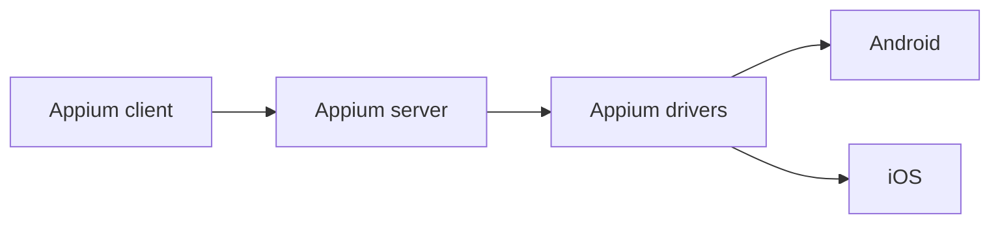

<Badge type="tip" text="Appium" /><Badge type="warning" text="Automation Framework" />

::: info
This article will introduce Appium installation, setup of basic drivers, and basic
usage, with a focus on Java and the XCUITestDriver.
:::

::: tip
:bulb: [Official Tutorial](https://appium.github.io/appium.io/docs/) :star2:
:::

## What is Appium

- Appium is an open source mobile automation library that helps in to automate
  android and iOS applications.
- It can automated native, hybrid or web applications.
- It also support automating smart TV, windows and MacOS based desktop applications.
- Appium 2.0 follows W3C specifications as it uses selenium API's internally.

## Why to use Appium

- Supports multiple programming languages to choose from when writing Appium tests.
- Provides seamless experience of interacting with application under tests.

## Appium ecosystem

## Appium architecture

