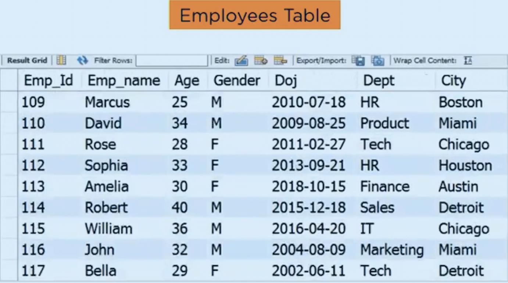
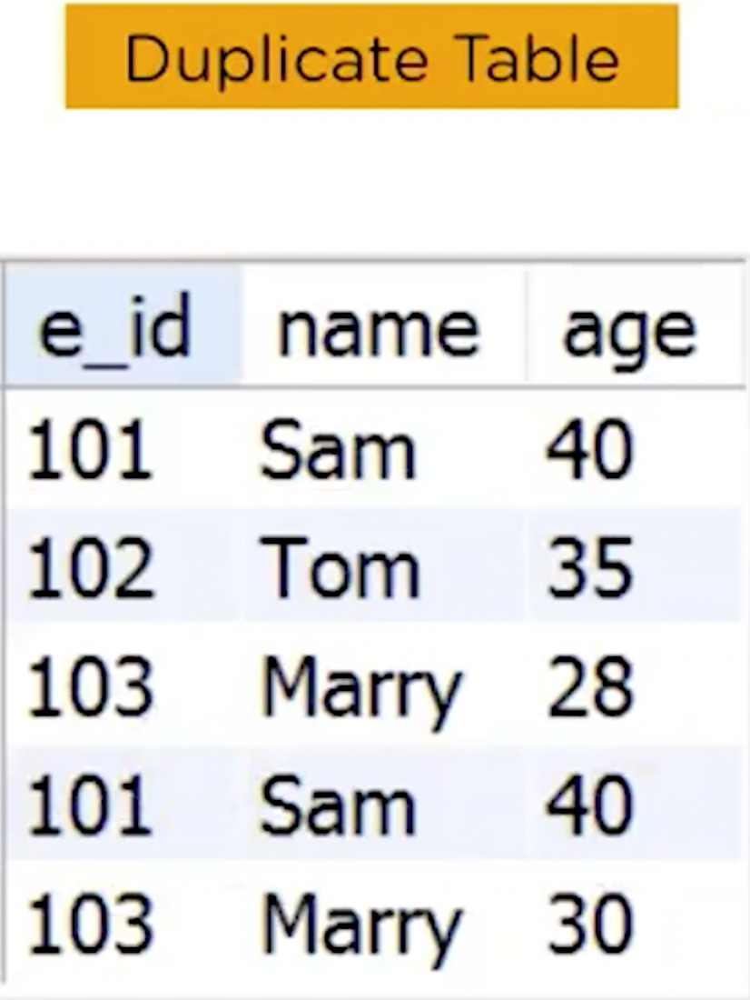
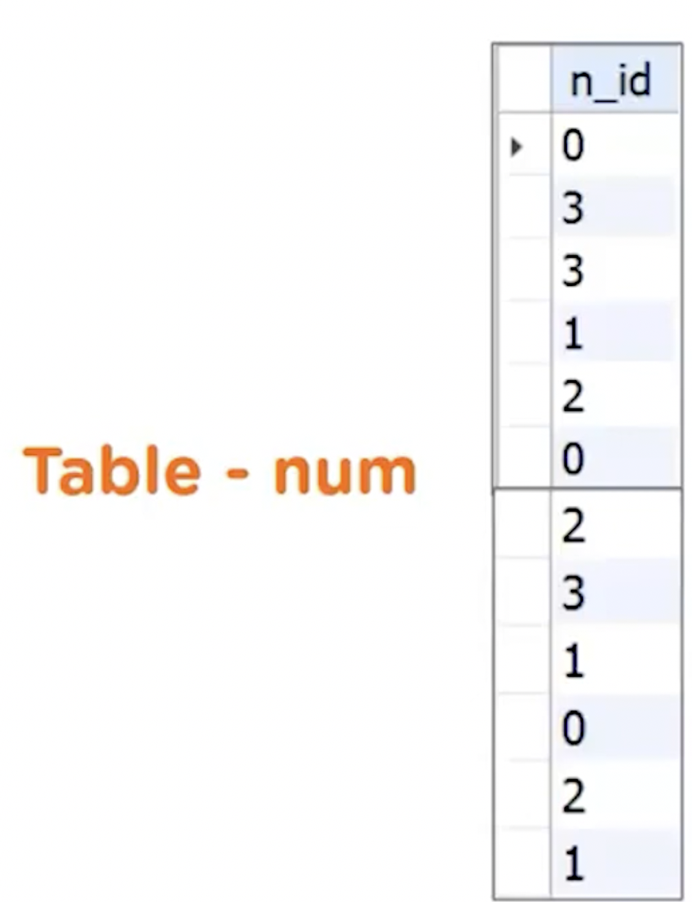
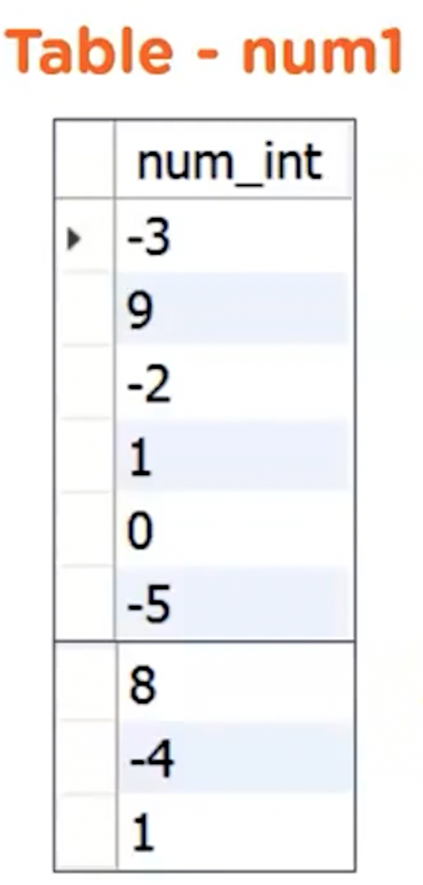
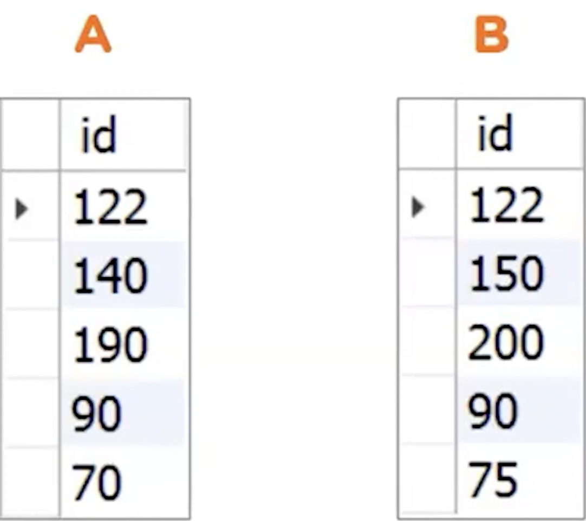

# Questions Collections <Badge type="tip" text="SQL" /><Badge type="warning" text="Notes" />

## What is NoSQL?

`NoSQL`, short for "Not Only SQL" or "non-relational", is a category of database
management systems that differ from traditional relational databases in their
approach to data storage and retrieval. Here's a rundown of its key characteristics:

**Data Storage:**

- _No rigid schema_: Unlike relational databases with predefined tables and columns,
  NoSQL databases offer flexible data structures like documents, key-value pairs,
  or graphs. Data can evolve organically without schema modifications.
- _Scalability_: NoSQL databases excel at horizontal scaling, where additional
  servers are added to handle increasing data volume and user requests.
- _Distributed architecture_: Data is distributed across multiple servers,
  promoting fault tolerance and improving performance.

**Data Retrieval:**

- _Non-SQL query language_: Each NoSQL type employs its own query language, distinct
  from SQL use in relational databases. Some languages are more expressive than
  others, focusing on specific data models.
- _Flexible querying_: NoSQL databases prioritize adaptability and allow querying
  based on various data attributes and structures.

**Use Cases:**

- _Big data_: NoSQL databases are ideal for storing and processing massive datasets
  efficiently, making them popular for analysis, real-time applications, and large-
  scale web services.
- _Unstructured_ data: NoSQL databases handle unstructured and semi-structured data
  efficiently, such as social media posts, senor readings, and log files.
- _High availability_: Distributed and fault-tolerant architecture ensures uninterrupted
  data access even if individual servers fail.

**Popular NoSQL Types:**

- Document databases (MongoDB, Couchbase)
- Key-value stores (Redis, Cassandra)
- Wide-column stores (Amazon DynamoDB, HBase)
- Graph databases (Neo4j, OrientDB)

**Pros and Cons:**

Pros:

- Scalability and flexibility
- Efficiently and unstructured data
- High availability and fault tolerance
- Simpler schema design and data modification

Cons:

- No standardized query language
- Potential for data consistency issues in some types
- May require additional expertise for query optimization and data management

## State the difference between WHERE and HAVING in SQL?

WHERE:

- Filters individual rows before grouping and aggregation.
- Operates on individual rows within tables.
- Typically used with SELECT, UPDATE, and DELETE statements.

HAVING:

- Filters groups of rows after aggregation.
- Operates on the results of aggregate functions (like SUM, COUNT, AVG)
- Used exclusively with the GROUP BY clause.

Key Difference:

- Timing: WHERE files before grouping, HAVING filters after grouping.
- Scope: WHERE works in individual rows, HAVING works on aggregated results.
- Usage: WHERE can be sued with various statements, HAVING only with GROUP BY.

When to Use Each:

- Use WHERE to filter rows based on specific conditions before aggregation.
- Use HAVING to filter groups of rows based on aggregate values after aggregation.

## How is DROP Different from TRUNCATE?

DROP:

- Definition: Removes the table definition and all its data permanently.
- Operation: Deletes the table from the database schema, freeing up the associated
  storage space.
- Impact: Once data is dropped, it's unrecoverable. Use with caution!
- Use cases: Removing unused or unwanted tables, restructuring the database schema.

TRUNCATE:

- Definition: Removes all rows from a table, leaving the table definition intact.
- Operation: Empties the table but retains the table structure and allocated storage
  space.
- Impact: Data is gone, but the table still exists and can be populated again.
- Use cases: Resetting test data, clearing temporary tables, quickly removing bulk
  data.

## Find the lowest salary of the employees in each department {#employees-table}



::: details Click to view answers

```sql
SELECT dept, MIN(salary) as lowest_salary
FROM employees
GROUP BY salary;
```

:::

## Which query will help you fetch unique values from a colum in a table?

```txt{3}
a) SELECT UNIQUE column_name FROM table_name;
b) SELECT column_name FROM table_name WHERE COUNT(column_name) = 1;
c) SELECT DISTINCT column_name FROM table_name;
d) SELECT column_name FROM table_name HAVING COUNT(column_name) = 1;

```

Answer: C.

## White the SQL query to fetch unique departments from the Employees table

Employees table in [_this section_](#employees-table).

::: details Click to view answers

```sql
SELECT DISTINCT dept FROM employees;
```

:::

## Write an SQL query to fetch the unique values of departments and print their length

Employees table in [_this section_](#employees-table).

::: details Click to view answers

```sql
SELECT DISTINCT dept, LENGTH(dept) AS length_dept
FROM employees;
```

:::

## What is the use of the DATEDIFF function in SQL?

The `DATEDIFF` function returns the number of days between two date, datetime,
or timestamp values. (MySQL: ✅, PostgreSQL: 🚫)

::: details Click to view answers

```sql
SELECT DATEDIFF('2021-01-16', '2023-01-10'); -- -724
SELECT DATEDIFF(NOW(), '2024-01-01'); -- 9
```

:::

## Write an SQL query to display the departments that have more that 2 employees

Employees table in [_this section_](#employees-table).

::: details Click to view answers

```sql
SELECT dept, COUNT(emp_id)
FROM employees
GROUP BY dept
HAVING COUNT(emp_id) > 2;
```

:::

## Display the details of the employee for all the departments except Marketing

Employees table in [_this section_](#employees-table).

::: details Click to view answers

```sql
SELECT *  FROM employees WHERE dept <> 'Marketing';
-- or
SELECT *  FROM employees WHERE dept != 'Marketing';
```

:::

## Write an SQL query to print details of the employees who have joined in before April 2010 and after May 2005

Employees table in [_this section_](#employees-table).

::: details Click to view answers

```sql
SELECT * FROM employees
WHERE doj > '2005-05-31'
AND doj < '2010-04-01'
```

:::

## Find the employee with the 3rd highest salary from the table

Employees table in [_this section_](#employees-table).

::: details Click to view answers

```sql
SELECT * FROM employee
ORDER BY salary DESC
OFFSET 2
LIMIT 1;

-- or
SELECT * FROM (
  SELECT * FROM employees
  ORDER BY salary DESC LIMIT 3
) AS res
ORDER BY salary LIMIT 1;
```

:::

## Print all the alternate records in a table

::: details Click to view answers

```sql
WITH cte AS (
  SELECT *, ROW_NUMBER() OVER (ORDER BY emp_id) as rn
  FROM employees;
)
```

:::

## Write the SQL query to fetch all the duplicate rows in a table



::: details Click to view answers

```sql
SELECT e_id, name, COUNT(*) as dup_count
FROM dup_employees
GROUP BY e_id, name, age
HAVING COUNT(e_id) > 1
  AND COUNT(name) > 1
  AND COUNT(age) > 1;
```

:::

## Display the employees with exactly 2 A's in their name

Employees table in [_this section_](#employees-table).

::: details Click to view answers

```sql
SELECT * FROM employees
WHERE LENGTH(emp_name) - LENGTH(REPLACE(UPPER(emp_name), 'A', '')) = 2;
```

:::

## Given a string, how will you extract four characters staring from the second position

::: details Click to view answers

```sql
SELECT SUBSTR('Michael Ballack', 2, 4);
SELECT SUBSTRING('Michael Ballack', 2, 4);
```

:::

## How does SELF JOIN work?

The `SELF JOIN0` joins a table to itself. The table must contain a column (x)
that acts as the primary key and a different column (y) that stores values that
can be matched up with the values in column x.

## Which of the following is called a virtual table in SQL

```txt{3}
a) Empty Table
b) Self Join
c) View
d) Common Table Expression
```

Answer: C.

## Write an SQL query to fetch the list of employees with the same salary

Employees table in [_this section_](#employees-table).

::: details Click to view answers

```sql
SELECT DISTINCT e.emp_id, e.emp_name, e.salary
FROM employees e, employees e1
WHERE e.salary = e1.salary AND e.emp_id != e1.emp_id;
```

:::

## Write an SQL query to print one row twice in results from table

Employees table in [_this section_](#employees-table).

::: details Click to view answers

```sql
SELECT emp_name, dept
FROM employees e
WHERE e.dept = 'HR'
UNION ALL
SELECT emp_name, dept
FROM employees e
WHERE e.dept = 'HR';
```

:::

## Write the num table, write a query to add 10 where number is 0, 20 when num is 1, else print the num itself



::: details Click to view answers

```sql
SELECT n_id
CASE
	WHEN n_id = 0 THEN n_id + 10
	WHEN n_id = 1 THEN n_id + 20
	ELSE n_id
END AS num_add_result
FROM num;
```

:::

## Given a num1 table, write a query to find the sum of all positive values and the negative values



::: details Click to view answers

```sql
SELECT SUM(CASE WHEN num1 > 0 THEN num1 ELSE 0 END) AS positive_sum,
       SUM(CASE WHEN num1 < 0 THEN num1 ELSE 0 END) AS negative_sum
FROM num1;
```

:::

## What is the difference between PRIMARY KEY and FOREIGN KEY?

Both **PRIMARY KEY** and **FOREIGN KEY** play crucial roles in data integrity and relationships
between tables. However, they serve distinct purposes:

**PRIMARY KEY:**

- _Unique identifier_: Uniquely identifies each rows within a table. No two rows can
  have the same value for the primary key columns.
- _Enforces data integrity_: Prevents duplicate entries and ensure consistent identification
  of rows.
- _Typically a single column or a combination of columns_: Offers optimal performance
  for data retrieval and joins.
- _Can't be NULL_: Every row must have a defined value for the primary key.

**FOREIGN KEY:**

- _References another table's primary key:_ Creates a link between two tables, ensuring
  data consistency across them.
- _Maintains referential integrity_: Prevents orphaned rows in the referencing table
  by ensuring referenced rows exist in the referenced table.
- _Can be a single column or combination of columns_: Must match the referenced
  tables's primary key structure.
- _Can be NULL_: Allows for optional associations or incomplete data in the referencing
  table.

## What is the difference between PRIMARY KEY and UNION?

| Feature        | PRIMARY KEY                           | UNION                                         |
| -------------- | ------------------------------------- | --------------------------------------------- |
| Purpose        | Data integrity, unique identification | Combing data sets                             |
| Scope          | Within a single table                 | Across multiple tables or queries             |
| Uniqueness     | Enforces unique rows                  | Removes duplicate rows in the combined result |
| Data structure | Specific columns define the key       | Flexible, based on query results              |
| Null Values    | NOt allowed                           | Allowed in some UNION variables               |

## What is a check constraint in SQL?

The check constraint is used to limit the values that can be inserted into a column.

## Given 2 tables A and B, write a query to fetch values in table B that are not present in A



::: details Click to view answers

```sql
SELECT id FROM b
LEFT JOIN a USING (id)
WHERE a.id IS NULL;
```

:::
